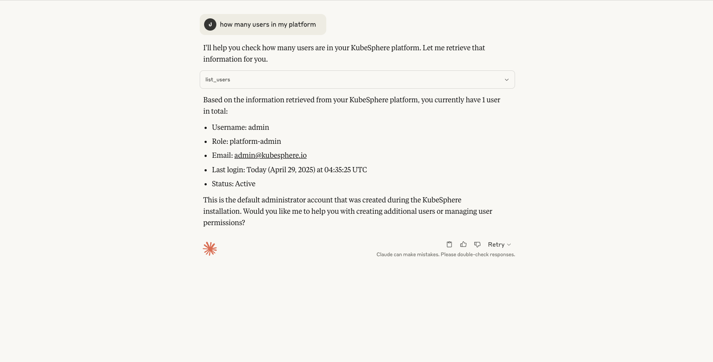
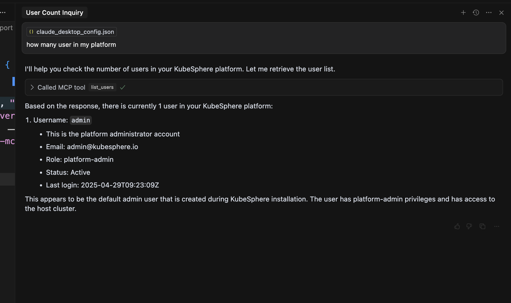

# KubeSphere MCP Server
The KubeSphere MCP Server is a [Model Context Protocol(MCP)](https://modelcontextprotocol.io/introduction) server that provides integration with KubeSphere APIs, enabling to get resources from KubeSphere. Divided into four tools modules: `Workspace Management`, `Cluster Management`, `User and Roles`, `Extensions Center`.

## Prerequisites
1. You must have a KubeSphere cluster. contains: Access Address, Username, Password.
2. Should get ks-mcp-server binary to run the server by stdio. this binary should put in `$PATH`
3. You should have a MCP Clients. like: Claude Desktop, Cursor etc. 

## Installation
### Usage with Claude Desktop
#### Generate KSConfig
The format is similar to kubeconfig. This configuration contains HTTP connector information. The default context for KubeSphere is `kubesphere`, which can be modified via the environment variable `KUBESPHERE_CONTEXT`. The server address in the configuration must use HTTPS (if your endpoint uses HTTP, you should override it using the `--ks-apiserver` argument).
```yaml
apiVersion: v1
clusters:
- cluster:
    certificate-authority-data: xxxx
    server: https://kubesphere.com
  name: kubesphere
contexts:
- context:
    cluster: kubesphere
    user: admin
  name: kubesphere
current-context: kubesphere
kind: Config
preferences: {}
users:
- name: admin
  user:
    username: xxxx
    password: xxxx
```
#### Get ks-mcp-server binary
you can run command `go build -o ks-mcp-server cmd/main.go` or download from (github releases)[https://github.com/kubesphere/ks-mcp-server/releases]
and then move it to `$PATH`.

#### Configuration MCP Server in Claude Desktop
According to [Claude Desktop](https://modelcontextprotocol.io/quickstart/user)
should change the MCP Configuration. like:
```json
{
  "mcpServers": {
    "KS-MCP-Server": {
      "args": [
        "stdio",
        "--ksconfig", "[to-be-replace]/kubeconfig",
        "--ks-apiserver", "http://[to-be-replace]:30880"
      ],
      "command": "ks-mcp-server"
    }
  }
}
```
then chat with mcp server


### Usage with Cursor
#### Generate KSConfig
The format is similar to kubeconfig. This configuration contains HTTP connector information. The default context for KubeSphere is `kubesphere`, which can be modified via the environment variable `KUBESPHERE_CONTEXT`. The server address in the configuration must use HTTPS (if your endpoint uses HTTP, you should override it using the `--ks-apiserver` argument).
```yaml
apiVersion: v1
clusters:
- cluster:
    certificate-authority-data: xxxx
    server: https://kubesphere.com
  name: kubesphere
contexts:
- context:
    cluster: kubesphere
    user: admin
  name: kubesphere
current-context: kubesphere
kind: Config
preferences: {}
users:
- name: admin
  user:
    username: xxxx
    password: xxxx
```
#### Get ks-mcp-server binary
you can run command `go build -o ks-mcp-server cmd/main.go` or download from (github releases)[https://github.com/kubesphere/ks-mcp-server/releases]
and then move it to `$PATH`.

### Configuration MCP Server in Cursor
According to [Curosr](https://docs.cursor.com/context/model-context-protocol)
should change the MCP Configuration. like:
```json
{
  "mcpServers": {
    "KS-MCP-Server": {
      "command": "ks-mcp-server",
      "args": [
        "stdio",
        "--ksconfig","[to-be-replace]/kubeconfig",
        "--ks-apiserver","http://[to-be-replace]:30880"
      ]
    }
  }
}
```
then chat with mcp server

